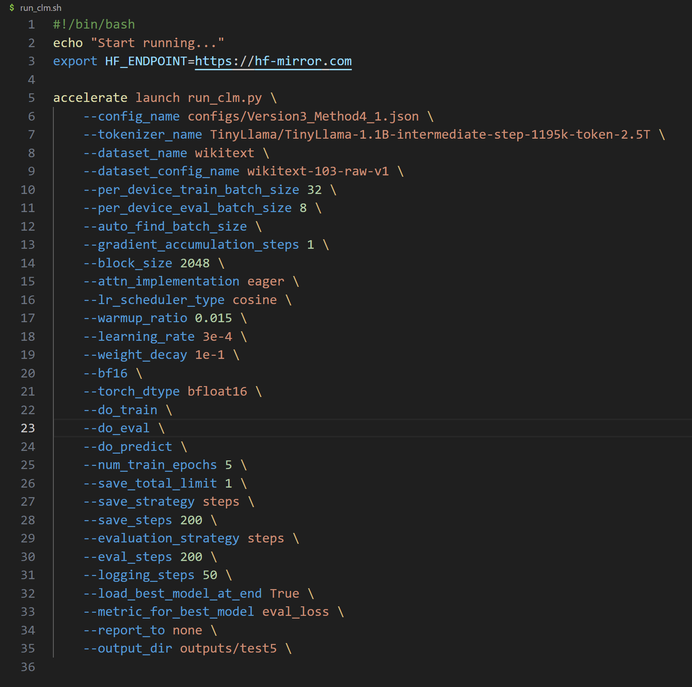

# Auto_Training_Script_For_TKWLab3090

### 功能概览

基于tmux功能实现。对于tmux中的所有模型训练任务，每隔60秒（可调整）逐个检测是否因算力紧张被抢占下线。对于下线的任务实现自动重新上线排队。

对于重新上线排队的任务，会生成log.txt文件并在文件中生成历史记录。

适用于tukw课题组**3090**集群**多模型单卡同时训练**的任务。hf-starter使用者可几乎无需修改任何脚本功能函数的实现。（更多情况暂未尝试，但可能对脚本内容微调后也可使用）

### 文件概览

* tmux_script.py：若干种tmux指令的快捷一键式实现
* train_script
  * train_script.py：模型检测重上线脚本
  * star_monitor.sh：train_script启动脚本（train_script.py本身也可一键运行）

### 原理（train_script）

* 设置三个列表：configs_name、output_dir_name、sessions_name。三个列表同一下标对应同一模型训练任务的配置文件路径、output路径、所在tmux窗口名称，**作为session_name与其余二者的映射标准**。例如三个列表为[v3m1,v3m2],[method1,method2],[m1,m2],则三个列表的下标1对应：模型的配置文件为configs/v3m2.json，训练的输出路径为outputs/method2，所在的tmux窗口为m2。（列表映射规则、路径格式可能需要根据本地工作区情况调整）
* 每60秒开启一个循环。每循环完成以下操作：
  * 获取当前所有tmux session名称
  * 对于每个session name，构建session name与config路径、output dir路径的映射
  * 逐个检查tmux session的状态：
    * 若为运行状态，则视为模型正常训练
    * 若为空闲状态，检测是否为训练完成
    * 若空闲且未训练完成，则视为任务抢占下线，实施重新上线操作
  * 对于重新上线操作，新建临时sh脚本文件。该脚本文件修改run_clm.sh（模型训练脚本）中的--config_name与--output_dir两项为当前下线任务对应的配置（如下图），向tmux重新提交训练任务：srun -N 1 -n 1 -X -u -p normal --gres=gpu:1 -c 2 --mem=1M -t 0-96:00:00 bash {temp_filename_run_clm}.sh（具体指令可能根据实际情况调整）。修改后的脚本有30秒时间供训练任务读入，30秒后删除。

### 运行方式
可直接拷贝至本地工作区，根据“原理”中相关实现细节具体调整后一键运行